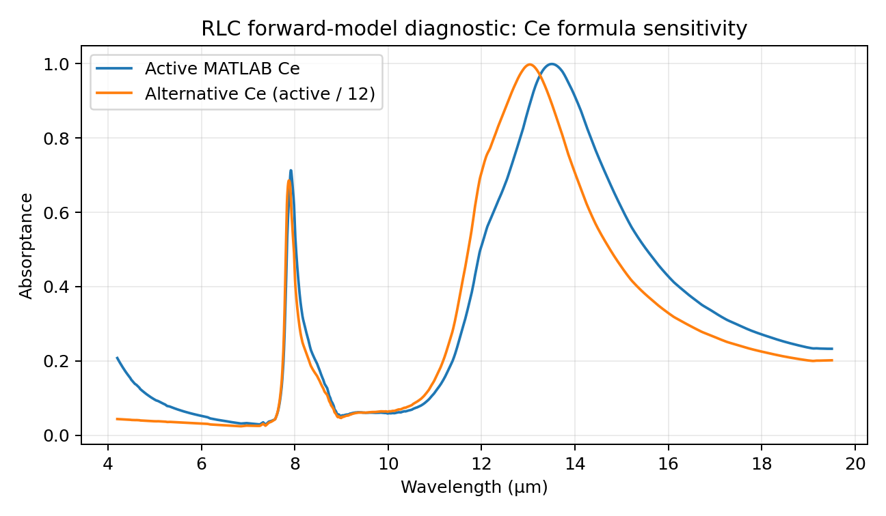

# RLC Model 技术审阅与 LWI 后续研究路线

**审阅日期：** 2026-09-23

**项目：** LWI Infrared Microbolometer Sensor Design and Optimization

**目的：** 解释 Kinzel 组未完成的 HCP metasurface RLC model，审计现有 manuscript / MATLAB / material data，判断独立完成 RLC paper 的可行性，并给出之后接入 LWI V1/V2 sensor optimization 的工程路线。

## TL;DR

这套所谓的 **RLC Model** 不是让我们真的去焊 resistor、inductor、capacitor，也不是一个需要 LJ 先制造 sensor 才能继续的实验项目。它本质上是一个 **physics-informed Equivalent Circuit Model**：把真实的 **metal–insulator–metal (MIM) metasurface** 在 infrared 下的电磁响应，用等效的 R、L、C 和 impedance Z 表示，再用少量 **HFSS/FEM full-wave simulation** 去校准经验系数。HFSS 是慢而高保真的 ground truth；RLC 是快很多、带物理结构的 surrogate。它最终输出的仍然是一条 wavelength-dependent absorptance curve，因此可以作为 LWI 现在 Gaussian spectral response 的物理化替代。

所以，**LJ 完全可以在不 fabrication sensor 的情况下，对这篇 paper 做出足够实质的 computational contribution**：整理和重构模型、补全 coefficient fitting、实现 design-space segmentation、得到 HFSS data 后做 calibration 和 held-out validation、做 complex reflectance / peak / Q-factor error analysis、重写 manuscript。当前真正卡住的不是“不会造 sensor”，而是**缺少关键 HFSS reference data，而且模型版本没有冻结**。如果 paper 保留现有 abstract 中“用 MPL/FTIR 实验验证”的 claim，则还必须由 Kinzel 组提供真实 experimental data；否则就应该把 paper 明确写成 simulation/modeling paper。

当前材料**还不能直接投稿**。最严重的问题包括：缺少 MATLAB 第一行要求的 Al2-SiO2-Al2.xlsx；没有 segmentation/fitting pipeline；manuscript 的 Ce 公式与 active MATLAB implementation 相差 **12×**；draft 仍有 “This is wrong”“So is this!”“Finish this” 等未解决 comments；Experimental Results 只有 FTIR/MPL placeholder；Conclusion 为空。更关键的是，我按 active MATLAB 方程独立重建 forward model 后发现，Ce 两个版本会使同一 geometry 的预测 peak 从约 **13.50 µm** 移到约 **13.04 µm**。所以公式版本问题会实质改变结果，不能当成排版问题。

推荐顺序是：**先把 standalone RLC paper 救活，再接 LWI**。第一步只需要 Kinzel 给一组明确的数据和模型版本；一旦 HFSS reference spectra 拿到，剩下的大部分工作 LJ 都能在本地完成。

---

## 1. RLC 在当前 LWI 里的位置

### 1.1 V1/V2 现在做什么

当前 LWI pipeline 把每个 sensor channel 的 wavelength response 抽象成 Gaussian：

\[
\Phi_i(\lambda)
=
\exp\left[
-\frac{(\lambda-\mu_i)^2}{2\sigma_i^2}
\right].
\]

然后对 atmospheric transmission、blackbody radiance、substance emissivity 和 channel response 做 spectral integration：

\[
S_{ij}
=
\int
\tau_{\mathrm{atm}}(\lambda)
\;r_B(\lambda,T,n)
\;\epsilon_j(\lambda)
\;\Phi_i(\lambda)
\;d\lambda.
\]

这里 i 是 sensor channel，j 是 substance。积分后每种 substance 得到一个低维 fingerprint vector。当前优化器用 **Spectral Angle Mapper (SAM)** 比较 fingerprints，并最大化最难区分那一对 substance 的 angle。

这个 abstraction 很适合先回答：

> 如果我能自由选择 response curve 的 center 和 width，什么样的 spectral channels 最利于区分物质？

但 Gaussian 本身不是 fabrication model。它没有告诉我们：

> 要用什么 disk diameter、periodicity、dielectric thickness 和 material，才能真正得到这条 curve？

RLC model 正好填这一层。

### 1.2 换成 RLC 后的链条

\[
\text{geometry + materials}
\rightarrow
\text{RLC forward model}
\rightarrow
\Phi_i(\lambda)\approx A_i(\lambda)
\rightarrow
\text{scene integration}
\rightarrow
\text{fingerprints}
\rightarrow
\text{sensor-design objective}.
\]

也就是说：

- Gaussian model 的 input 是 \((\mu,\sigma)\)；
- RLC model 的 input 是更接近 fabrication 的 geometry/material parameters；
- 两者都输出 wavelength response curve；
- 下游 LWI integration 不需要推倒重来。

RLC 本质上是在替换最前面的 **channel-response generator**。

---

## 2. 邮件中 Kinzel 实际提出的工作

2026-02-28 到 2026-03-02 的邮件里，合作对象是 **Ed/Edward Kinzel**。邮件给出的状态很清楚：

1. 原本负责这部分工作的学生已经离开，paper 没有完成。
2. Kinzel 有较早的 modeling work，可以作为 basic model。
3. basic model 还需要 fit 到 **HFSS data**。
4. 他的设想是把 design space 分段，在若干离散 design points 上 fit RLC，然后用 segmented model 预测整个 design space 的 HFSS response。
5. 有了这个模型后，再通过 linear-algebra approach 优化 sensitivity / minimize uncertainty。
6. 他明确表示愿意继续合作，并说当时生成 fitting 所需 simulation data 大约是一周量级的工作。

最后一点只是 **2026-03-02 当时的估计**，不能理解成现在已经有那批数据。

这封邮件已经回答了一个重要问题：Kinzel 设想的核心 RLC workflow 是 **simulation + calibrated surrogate**。它并不要求 LJ 自己 fabrication microbolometer 才能开展。

---

## 3. 从底层理解 microbolometer 与 metasurface

### 3.1 Microbolometer

uncooled microbolometer 的基本链条是：

\[
\text{incident IR}
\rightarrow
\text{absorbed power}
\rightarrow
\Delta T
\rightarrow
\Delta R
\rightarrow
\text{electrical signal}.
\]

IR 被 pixel 吸收，pixel temperature 升高；temperature-sensitive layer 的 electrical resistance 随温度变化，于是 electronics 读出 signal。

传统 microbolometer 通常希望 LWIR 内尽量 broadband absorption。LWI 项目则希望多个不同的 **spectral channels** 把不同材料的 infrared emissivity fingerprint 投影成容易区分的低维 signal。

### 3.2 Metasurface 为什么能做 spectral filtering

Kinzel 组的结构属于 MIM：

1. top：periodic metallic disk array；
2. middle：one or more dielectric layers；
3. bottom：optically thick metal ground plane。

top disks 是 sub-wavelength resonators。incident electromagnetic field 会驱动 disk 和 ground plane 中的 charge/current；disk-ground 和 disk-disk 之间的 electric field 形成 charge storage；metal 有 finite conductivity，因此存在 dissipation。

这些效应组合起来产生 wavelength-selective resonance。

因为 bottom ground plane 足够厚，transmission 近似为零：

\[
T(\lambda)\approx 0.
\]

所以：

\[
A(\lambda)
=
1-R(\lambda)-T(\lambda)
\approx
1-R(\lambda).
\]

只要能预测 reflection，就能预测 absorptance。

---

## 4. 为什么 infrared metasurface 可以写成 RLC

RLC 不是说结构里真的存在宏观 discrete electronic components。它是 **electromagnetic field behavior 的 lumped equivalent representation**。

| Physical phenomenon | Equivalent circuit meaning |
|---|---|
| charge accumulation / electric-field energy | Capacitance C |
| current inertia / magnetic-field energy | Inductance L |
| Ohmic/material loss | Resistance R |
| incident/reflected EM wave | transmission-line voltage/current analogue |
| metasurface input response | equivalent impedance Z |

这类 Equivalent Circuit Model 在 MIM metasurface 文献中是成熟思路。它成立的根本原因不是“光真的变成电路电流”，而是 Maxwell equations 下的 field response 在 sub-wavelength regime 可以被低阶 impedance model 近似。

当前 HCP disk model 中：

| Element | Physical interpretation |
|---|---|
| \(R_c\) | top disk metal dissipation |
| \(L_c\) | top disk electron/kinetic inductance |
| \(R_g\) | ground-plane metal dissipation |
| \(L_g\) / \(L_{cg}\) | ground-plane kinetic contribution |
| \(L_m\) | magnetic contribution associated with disk-ground current loop |
| \(C_m\) | disk-ground dielectric capacitance |
| \(C_e\) | coupling capacitance between neighboring HCP unit cells |

最容易混淆的一点是：

> **这里的 electrical capacitance \(C_m,C_e\) 和 microbolometer thermal heat capacity \(C_{\mathrm{th}}\) 不是一个东西。**

2021 ACES paper 讨论 thermal time constant 时有：

\[
\tau_{\mathrm{th}}=\frac{C_{\mathrm{th}}}{G}.
\]

这里的 \(C_{\mathrm{th}}\) 是 heat capacity，物理意义完全不同。

---

## 5. Active MATLAB 实际实现了什么

当前 RLC Model/Code/Final_Al2_SiO2_Si_Al2_new.m 是现有材料里最接近 executable specification 的文件。

### 5.1 Material dispersion

代码读取：

- Al2.xlsx
- SiO2.xlsx
- Sipermittivity.xlsx

然后用 MATLAB Curve Fitting Toolbox 的 pchipinterp 插值 complex permittivity。

代码采用：

\[
\epsilon(\omega)
=
\epsilon'(\omega)
-
j\epsilon_{\mathrm{table},3}(\omega).
\]

Al 和 Si 的第三列在相关范围内为正；SiO2 第三列同时存在负、零、正值，因此这个 sign convention 必须追溯原始 optical-constant source，不能简单把第三列取 absolute value。

### 5.2 Aluminum Drude fit

代码还会对 Al loss 做 Drude-style fit，得到 plasma-frequency-like parameter \(\omega_p\) 和 metal relaxation time \(\tau_{\mathrm{metal}}\)，再计算：

\[
\sigma_{\mathrm{Al}}
=
\epsilon_0\omega_p^2\tau_{\mathrm{metal}},
\]

以及 penetration depth：

\[
\delta
=
\frac{\lambda}{2\pi k}.
\]

我用 SciPy 对同一 workbook 独立复现这段 fitting，得到约：

\[
\omega_p \approx 1.421\times10^{16},
\qquad
\tau_{\mathrm{metal}}\approx 3.49\times10^{-15}\;\mathrm{s}.
\]

这是 independent sanity check。正式 paper 应冻结一个 implementation，并记录 optimizer、bounds、material source 和 units。

### 5.3 Geometry-dependent coefficient

active code 用：

\[
g
=
1.672111576
\exp\left[
\left(d-0.588613726p\right)10^6
\right],
\]

其中 \(d,p\) 在代码内部已经转换为 meter，所以 \(10^6\) 把 exponent 中的长度组合转换为 micrometer-scale numerical value。

然后：

\[
c_1=c_3=\frac{1}{g},
\qquad
c_4=0.2.
\]

这里存在 manuscript/code notation 问题：draft prose 写拟合常数 \(c_1=0.2,c_2=1.672,c_3=0.589\)，而 MATLAB 用数组 \([1.672...,0.5886...,0.2]\)，之后又重新定义 local c1/c2/c3/c4。数值能够大致对应，但**变量名体系不一致**。正式版本必须统一 notation。

### 5.4 Multilayer gap capacitance

active code：

\[
C_m
=
\frac{
c_1\epsilon_0\pi(d/2)^2
}{
4
\left(
h_{\mathrm{Si}}/\epsilon_{\mathrm{Si}}
+
h_{\mathrm{SiO_2}}/\epsilon_{\mathrm{SiO_2}}
\right)
}.
\]

直观上，不同 dielectric layers 沿 disk-ground electric-field direction 串联地贡献 effective dielectric spacing。

由于 \(\epsilon(\lambda)\) 是 complex、dispersive 的，\(C_m\) 也随 wavelength 变化，因此 dielectric dispersion / phonon behavior 可以部分进入 model。

### 5.5 Magnetic / kinetic terms

\[
L_m=\frac{\mu_0hg}{2},
\]

\[
R_c=\frac{g}{\delta\sigma_{\mathrm{Al}}},
\qquad
L_c=\frac{g}{\delta\epsilon_0\omega_p^2},
\]

\[
R_g
=
\frac{gc_4}{\delta\sigma_{\mathrm{Al}}},
\qquad
L_{cg}
=
\frac{gc_4}{\delta\epsilon_0\omega_p^2}.
\]

然后：

\[
L_t=L_c+L_m,
\qquad
L_g=L_{cg}+L_m.
\]

### 5.6 Circuit impedance

active code 的三个 parallel branches 是：

\[
Z_t
=
R_c+j\omega L_t,
\]

\[
Z_b
=
\frac{2}{j\omega C_m}
+
R_g
+
j\omega L_g,
\]

\[
Z_e
=
\frac{1}{j\omega C_e}.
\]

总 impedance：

\[
Z
=
\left(
\frac{1}{Z_t}
+
\frac{1}{Z_b}
+
\frac{1}{Z_e}
\right)^{-1}.
\]

相对于 free-space impedance \(Z_0=377\ \Omega\)：

\[
\Gamma
=
\frac{Z-Z_0}{Z+Z_0},
\qquad
A
=
1-|\Gamma|^2.
\]

这就是整个 model 从 geometry/material 走到 absorptance 的核心。

---

## 6. Resonance 和 Perfect Absorption 不是一回事

一个 LC system 的 resonance 大致满足：

\[
\omega_0\sim\frac{1}{\sqrt{LC}}.
\]

resonance 主要意味着 reactive terms 抵消，也就是 total impedance 的 imaginary part 接近 zero。

但要得到 **perfect absorber**，还需要整个 metasurface 与 incoming free-space wave impedance match：

\[
\operatorname{Im}(Z)\approx0,
\qquad
\operatorname{Re}(Z)\approx377\ \Omega.
\]

如果只满足第一条，system 有 resonance，但 incident power 仍可能大量 reflection。

如果两条同时满足：

\[
\Gamma
=
\frac{Z-Z_0}{Z+Z_0}
\rightarrow0,
\]

于是：

\[
A\rightarrow1.
\]

因此：

- L/C 很大程度上决定 resonance 在哪里；
- R、dielectric loss、coupling 和 geometry 一起决定 impedance matching、peak height、bandwidth；
- **“有一个峰”不等于“perfect absorber”。**

---

## 7. Geometry 参数的物理直觉

### Disk diameter \(d\)

draft 在 low-loss / first-mode approximation 下给出：

\[
\lambda_0
\approx
\pi d
\sqrt{
\frac{\epsilon_{\mathrm{diele}}\pi}{8}
}.
\]

它表达的 first-order intuition 是：

> **disk diameter 是 resonant wavelength 的主要 knob。**

但这不是 universal exact law。真实 model 中 \(p,h,C_e\)、material dispersion、metal loss 和 higher-order modes 都会造成偏离。

### Periodicity \(p\)

\(p\) 决定 neighboring disks 的 spacing \(p-d\)，因此强烈影响 inter-cell electric coupling，也进入 empirical \(g\)。改变 gap 会改变 \(C_e\)，进而改变 peak location、line shape 和 matching。

### Dielectric thickness \(h\)

\(h\) 同时影响：

- disk-ground capacitance \(C_m\)；
- magnetic inductance \(L_m\)；
- dielectric phase/coupling；
- thermal mass。

所以它是典型的 optical/thermal tradeoff parameter。

### Material

Metal 的 complex permittivity / Drude loss 影响 R/L。Dielectric 的 complex permittivity 影响 \(C_m\)，并可能引入 strong dispersion / phonon resonances。

这也是 RLC 相比 Gaussian 更有物理价值的地方：它可以解释“为什么换 material 或 stack，response curve 会这样变”。

---

## 8. HFSS 与 RLC 的正确关系

HFSS/FEM 求的是 Maxwell equations 下 full-wave electromagnetic field，可以自然包含：

- local field distribution；
- complex material dispersion；
- electromagnetic coupling；
- higher-order modes；
- Fabry–Perot behavior；
- finite geometry / boundary effects，取决于 simulation setup。

代价是每个 geometry 都要重新 solve，optimizer 需要大量 candidate evaluations 时非常贵。

RLC 是 low-order surrogate：

\[
\text{geometry/material}
\rightarrow
\text{a few R/L/C terms}
\rightarrow
Z(\lambda)
\rightarrow
A(\lambda).
\]

优点是 evaluation 快、parameters 有物理解释、可以做 analytical reasoning，也能放进 GA / MAP-Elites 高频调用。

缺点是 circuit topology 已经假设主要 mode，higher-order modes 未必有对应 branch，而且 empirical coefficients 必须 calibration，超出 fit region 不能默认可靠。

draft 自己已经给出一个很好的 failure example：较厚 Ge layer 的 HFSS curve 在约 5–6 µm 出现额外 Fabry–Perot peaks，而 simple RLC topology 没有捕获。这应作为明确 domain boundary，而不是隐藏。

---

## 9. “Segment the design space” 应该怎么理解

现有文件里没有找到已经实现的 segmentation algorithm。下面是根据 Kinzel 邮件和现有 model 对其意图最合理的 reconstruction，正式执行前应让 Kinzel 确认。

设 geometry/material design vector：

\[
\theta
=
[d,p,h,h_{\mathrm{oxide}},\text{material},\ldots].
\]

HFSS 给：

\[
r_{\mathrm{HFSS}}(\lambda;\theta).
\]

RLC model 给：

\[
r_{\mathrm{RLC}}(\lambda;\theta,\beta),
\]

其中 \(\beta\) 是 empirical correction coefficients。

如果一个 global \(\beta\) 无法覆盖整个 geometry domain，就把 design space 划成：

\[
\Theta
=
\Theta_1\cup\Theta_2\cup\cdots\cup\Theta_K.
\]

每个 region 单独 fit：

\[
\beta_k^\*
=
\arg\min_{\beta_k}
\sum_{\theta_i\in\Theta_k}
\sum_{\lambda}
w_\lambda
\left|
r_{\mathrm{RLC}}(\lambda;\theta_i,\beta_k)
-
r_{\mathrm{HFSS}}(\lambda;\theta_i)
\right|^2.
\]

new geometry 先决定属于哪个 segment，再用对应 local model。

这很像 machine-learning surrogate，只是 surrogate 不是 black box，而是有 physics structure 的 RLC equations。

### 为什么最好 fit complex reflection

只拟合：

\[
A=1-|r|^2
\]

会丢掉 phase。不同 complex \(r\) 可能得到类似 \(|r|^2\)，因此只对 absorptance fit 会造成 parameter non-identifiability。

draft comments 已明确要求：

- Add reflectance including phase；
- 检查 complex-space accuracy。

正式 calibration 优先目标应是 complex \(S_{11}\)/reflection；absorptance 再作为 downstream observable 验证。

---

## 10. 三份 collaborator 文件分别给了什么

原始附件保存在 `RLC Model/`：`Liu_Tao_Final.pdf`、`RLC_Model_R0.doc`、
`Code.zip` 和解压后的 `Code/`。ZIP 中的五个 files 与解压文件逐一 byte-identical。
这些是 supplied reference materials；保留其原始 bytes、line endings 和 workbook
metadata，不把原始 MATLAB 当作已完成 calibration/validation 的 production implementation。

### Liu_Tao_Final.pdf

这不是 thesis，而是已发表的 2021 ACES conference paper：

**Tao Liu and Edward C. Kinzel, “Effect of Metasurface Quality Factor on the Thermal Time Constant in Microbolometers.”**

structure 包括：

- 50 nm Au ground plane；
- 25 nm Au HCP disks；
- amorphous-Si sensing layer；
- 部分设计含 50 nm ZnSe electrical-isolation layer；
- HFSS 优化 10.6 µm perfect absorption。

paper 使用：

\[
\tau_{\mathrm{th}}=\frac{C_{\mathrm{th}}}{G}
\]

并假设：

\[
G=10^{-7}\ \mathrm{W/K}
\]

和 40×40 µm² pixel。

表中 heat capacity 对应约 6.5–14 ms thermal time constant。这个数字来自 assumed \(G\) 和 modeled heat capacity，**不是新测得的 detector response time**。

它对当前项目的价值主要是说明 Kinzel 组长期在研究 optical-Q / thermal-mass tradeoff；它并没有补上当前 RLC draft 缺失的 calibration pipeline。

### RLC_Model_R0.doc

标题：

**“Lumped Parameter Modeling of HCP Metasurfaces at Infrared Wavelengths.”**

authors：

- Tao Liu
- Chen Zhu
- Edward Kinzel

paper skeleton 想做：

- HCP MIM metasurface 的 RLC equivalent model；
- 用 HFSS fit；
- 覆盖不同 dielectric / metal / multilayer stack；
- 从 RLC 推 perfect-absorber design relationships；
- 最终用 MPL + FTIR 做 experimental validation。

但当前明显是 working draft：

- Experimental Results 只有 Figure 9 MPL Setup；
- Figure 10 FTIR results...；
- Need 3 different cases. At least one perfect absorber.；
- Conclusion 为空；
- comments 中有 Finish this.；
- 还有 This is wrong / So is this!；
- reviewer notes 要求补 literature review、units、material source table、complex reflection phase、Q factor、non-perfect-absorber validation、derivation explanation、targeted HFSS validation 等。

它更像“已经有 paper skeleton 和部分结果，但方法版本没有冻结”。

### Code.zip

实际只有：

- Al2.xlsx
- SiO2.xlsx
- Sipermittivity.xlsx
- createFit.m
- Final_Al2_SiO2_Si_Al2_new.m

主 MATLAB 第一行却要求 Al2-SiO2-Al2.xlsx。当前 repo 全局 search 也没有找到该 workbook，所以现有 code **无法直接完整复现 paper figure**。

---

## 11. Code audit 的关键问题

### 11.1 缺 HFSS reference workbook

MATLAB 假设 reference workbook 有 3601 rows；first column 是 frequency；后续 columns 是不同 geometry spectra；当前 ii=48 时读取 reference column 49。

但 Al2-SiO2-Al2.xlsx 不在 supplied ZIP，也不在当前 project tree。这是最直接的 blocker。

### 11.2 代码实际只跑一个 geometry

dhp 列了 54 个 geometry points，但 active ii=48；后面的 loop bounds 都是当前单值。因此当前 script 是 single-case comparison/debug script，不是 complete sweep。

### 11.3 Geometry coefficients 没有自动 fitting

active coefficients 被 hard-coded。当前 lsqcurvefit 只是在 fit Aluminum Drude response；它**没有**自动 fit RLC geometry coefficients，也没有实现邮件里的 segmented calibration。

### 11.4 Ce 有 12× 版本冲突

active MATLAB：

\[
C_e^{\mathrm{active}}
=
3c_3\epsilon_0\pi(d/2)h/(p-d).
\]

代码里同时保留另一个 commented form：

\[
C_e^{\mathrm{alt}}
=
c_3\epsilon_0\pi(d/2)h/[4(p-d)].
\]

所以：

\[
C_e^{\mathrm{active}}
=
12C_e^{\mathrm{alt}}.
\]

对照已审阅 manuscript equation，printed Eq. 1c 与 alternative family 一致，而后续 perfect-absorber derivation 又更像依赖 active form。这必须由作者确认。

### 11.5 现有 R² 不是 conventional definition

代码的 total-sum-of-squares denominator 使用 model prediction 相对 prediction mean 的 variance，而 conventional \(R^2\) 应基于 observed/reference values。因此当前 Rsquare 不应直接进入 paper quantitative claim。

### 11.6 metal thickness variable 看起来未使用

script 定义 75 nm metal disk thickness variable，但 active impedance formulas 没有使用它。这与 draft reviewer 要求讨论 disk/ground thickness 的 comment 相呼应。

### 11.7 script 有文件 side effect

script 会写 optm2.mat。正式 pipeline 应改成 explicit output / pure forward functions，避免 optimizer 中每次 evaluation 都写 disk。

---

## 12. Material workbook numerical audit

### Al2.xlsx

- 303 numeric rows；
- frequency 单调递增，无 duplicates；
- frequency 约 15.275–171.733 THz；
- wavelength 约 19.626–1.746 µm；
- real permittivity 全为负；
- 第三列全为正，约 50.3–7037.8。

### SiO2.xlsx

- 2981 numeric rows；
- frequency 单调递增，无 duplicates；
- wavelength 约 619.9–4.133 µm；
- real part 约 -5.38 到 7.89；
- 第三列既有负值、0，也有正值。

在 LWI 关心的 4–20 µm 子范围：

- 2381 rows；
- third column negative 605 个；
- zero 686 个；
- positive 1090 个。

这不自动说明 data 错误，但必须找到 optical constants 的 source/sign convention 后再冻结。

### Sipermittivity.xlsx

- 359 numeric rows；
- worksheet 名为 al-real，命名容易误导；
- frequency 单调递增，无 duplicates；
- wavelength 约 43.18–1.366 µm；
- real part 约 11.683–12.239；
- third column 是很小的 positive loss-like value。

数据本身更像 Si permittivity；worksheet name 应在 data provenance 中修正或解释。

---

## 13. 我实际重建并跑了一次现有 forward model

为了确认现有 code 不是“完全无法工作的残片”，我用 Python/SciPy 按 active MATLAB equations 做了一个**只用于 diagnosis 的独立 reconstruction**。它没有改 production code，也不能替代缺失的 HFSS validation。

MATLAB 当前 ii=48 对应 geometry：

\[
[d,h,h_{\mathrm{SiO_2}},p]
=
[1.9512,\ 0.3000,\ 0.0100,\ 2.5991]\;\mu m.
\]

即：

- disk diameter \(d=1.9512\) µm；
- total dielectric height \(h=0.3\) µm；
- SiO2 thickness 0.01 µm；
- Si thickness 0.29 µm；
- periodicity \(p=2.5991\) µm。

### Active MATLAB Ce

- peak absorptance ≈ 0.99926；
- peak wavelength ≈ 13.502 µm；
- peak 附近 equivalent \(Z\approx357.1-j0.8\ \Omega\)；
- numerical FWHM ≈ 3.56 µm；
- corresponding \(Q\approx3.79\)。

### Ce/12 alternative

- peak absorptance ≈ 0.99796；
- peak wavelength ≈ 13.036 µm；
- peak 附近 equivalent \(Z\approx345.0+j6.1\ \Omega\)；
- FWHM ≈ 3.05 µm；
- \(Q\approx4.28\)。

两者都能产生“看起来很漂亮”的 near-perfect absorption，但 peak 相差约：

\[
0.466\ \mu m.
\]

这说明：

> **没有 HFSS reference，就不能仅凭 curve 看起来合理判断哪个 equation 是对的。**

诊断图：

这张图只能证明 implementation choice 对结果 materially significant；**不能证明 active MATLAB 比 manuscript equation 更正确**。

---

## 14. Manuscript 现有 figures 真正支持什么

### Figure 2：Al/Si/Al

可以支持 simple equivalent circuit 能近似 first resonance。

不能支持 model 已经在整个 design space quantitatively validated。reviewer comment 已经指出：同时改变多个 geometry parameters、主要展示 perfect absorbers，会让 reader 质疑 general applicability。

### Figure 3：ZnSe / Ge

最有价值的是暴露 limitation：thicker Ge 的 extra Fabry–Perot modes 没被 simple RLC 捕获。

### Figure 4：Au / Cr / Ni

说明 authors 想证明 metal generalization。但 final paper 需要完整 material parameter table、source、thickness 和 complex optical property convention。

### Figure 5：multilayer dielectric / oxide

这是很有潜力的 novelty：complex wavelength-dependent dielectric permittivity 进入 effective capacitance 后，可以保留部分 dielectric dispersion / phonon behavior。但仍需要 held-out HFSS quantitative validation。

### Experimental Results

当前没有 supplied experimental result。只有 MPL setup、FTIR placeholder，以及 “Need 3 different cases. At least one perfect absorber.”。

所以 abstract 目前写的 “validated using microsphere photolithography and FTIR” **没有 supplied evidence 支撑**。

---

## 15. Standalone RLC paper 能不能救

**能，而且值得做。**

但合理目标不是把旧稿文字补满就投稿，而是把它变成一个有 reproducible calibration/validation 的 modeling paper。

### Route A：simulation/modeling paper

这是 LJ 最可控的路线，不需要 LJ fabrication。

最低完整闭环：

1. freeze circuit topology 和 notation；
2. resolve Ce 版本；
3. 获得或重新生成 HFSS training design set；
4. 实现 coefficient fitting；
5. 实现 design-space segmentation，或证明 global fit 足够；
6. 用 **held-out HFSS geometries** 验证；
7. 至少报告 complex-reflection error、absorptance RMSE、peak-wavelength error、peak-absorptance error、FWHM/Q error；
8. validation 不只包括 perfect absorbers，也包括 deliberately off-matched geometries；
9. 明确 Fabry–Perot / higher-order failure modes；
10. runtime / speed comparison 只能在实际 benchmark 后写数字；
11. 重写 derivation 和 limitations；
12. 删除 unsupported FTIR claim。

这个版本已经可以形成 coherent paper。

### Route B：simulation + experimental validation

如果 Kinzel 组已经有 MPL/FTIR samples/data，paper 会更强。

还需要：

- sample SEM/metrology 或实际 \(d,p,h\)；
- exact layer thickness/material；
- FTIR raw/reference/background processing；
- angle of incidence；
- polarization；
- spectral resolution；
- repeatability / uncertainty；
- 至少一组不是专门挑出来的 perfect absorber。

如果这些 data 从未采完，就不应让 experiment 成为 LJ 的 prerequisite。先走 Route A。

---

## 16. LJ 能承担什么，Kinzel 组必须提供什么

### LJ 可以独立承担的 substantive contribution

1. **Model reconstruction**
   - 把 MATLAB script 重构成 reproducible functions；
   - 明确 inputs/outputs/units；
   - 建 tests。

2. **Calibration pipeline**
   - empirical coefficient fitting；
   - complex \(S_{11}\) objective；
   - constrained optimization；
   - segmentation。

3. **Validation**
   - train/held-out split；
   - full error metrics；
   - sensitivity analysis；
   - ablation，例如 Ce、material loss、multilayer terms。

4. **Paper figures**
   - model vs HFSS overlays；
   - peak/Q errors；
   - error maps over geometry space；
   - impedance trajectories；
   - complex reflection amplitude/phase。

5. **Paper writing**
   - Methods；
   - Validation；
   - limitations；
   - reproducibility；
   - derivation revision。

这些已经是正常而充分的 coauthor contribution，不需要把目标设成“只挂名”。

### Kinzel 组当前至少要给的内容

1. Al2-SiO2-Al2.xlsx 原始 reference workbook；
2. 54 个 dhp rows 对应的 HFSS spectra 与 column mapping；
3. 最好给 complex \(S_{11}\) amplitude + phase，而不仅是 absorptance；
4. HFSS project/setup，或至少 boundary conditions、source/port、incidence angle、polarization、mesh/convergence、layer thickness、material definitions；
5. 离开学生的最新 RLC code / coefficient-fitting code；
6. 如果已经做过 segmentation，segment definition 和 coefficients；
7. material optical constants 的原始 source/table；
8. Ce 哪个 equation 才是 intended final version；
9. 如果保留 experiment：FTIR raw data、MPL sample geometry/metrology、processing procedure；
10. manuscript 当前是否有后续 version、其他人是否在继续、author list 是否仍有效。

### 当前仓库里确定没有找到

bounded repository search 没找到：

- Al2-SiO2-Al2.xlsx；
- HFSS .aedt / .hfss project；
- FTIR dataset；
- segmented-RLC fitting script。

这些不能靠猜恢复。

---

## 17. Kinzel 所说的 linear-algebra uncertainty 与现在 SAM 的区别

旧 LWI code 里已经保留了很接近 Kinzel 邮件描述的方法：

\[
A^+=\operatorname{pinv}(A),
\]

\[
\Sigma_x
\propto
A^+(A^+)^T,
\]

\[
\mathrm{FOM}
=
\operatorname{tr}\left[A^+(A^+)^T\right].
\]

若 linear measurement model：

\[
y=Ax+\varepsilon,
\]

其中 y 是 channel measurements，A 是 pure-substance response matrix，x 是 mixture/concentration coefficients，且 \(\varepsilon\sim\mathcal{N}(0,\sigma^2I)\)，则 least-squares：

\[
\hat{x}=A^+y,
\]

并且：

\[
\operatorname{Cov}(\hat{x})
=
\sigma^2A^+(A^+)^T.
\]

忽略 common \(\sigma^2\) 后，trace 越小，total estimation uncertainty 越小。

直觉上它问的是：

> measurement noise 经过 inverse problem 以后，会被放大成多大的 substance-estimation uncertainty？

如果 A 接近 singular，不同 substance signatures 接近 linearly dependent，\(A^+\) 会很大，uncertainty 会爆炸。

### SAM 问的是另一个问题

当前 V1/V2 的 SAM：

\[
\theta(a,b)
=
\cos^{-1}
\frac{a^\top b}{\|a\|\|b\|}.
\]

它关心 pure-substance fingerprints 的 angle，基本不关心 common magnitude。

所以两组 fingerprints angle 很大但 signal 都很弱时，SAM 仍可能给高分；uncertainty objective 会因为 A 的 singular values 太小而惩罚这种设计。

full-column-rank 时：

\[
\operatorname{tr}
\left[A^+(A^+)^T\right]
\propto
\sum_i\frac{1}{s_i^2},
\]

其中 \(s_i\) 是 singular values。

因此它同时关心：

- directions 是否 linearly independent；
- signal matrix 的尺度是否足够；
- inverse problem 是否 well-conditioned。

RLC 接进来以后，不建议立即用一个指标完全取代另一个。更自然的是分别回答：

- **SAM**：pure substances 的 geometric separability；
- **linear uncertainty FOM**：mixture/unmixing under noise 的 estimation stability；
- 将来若有 detector noise，再做 SNR-aware objective。

这也说明 **RLC curve 不应该统一 normalize 到 unit peak**，否则真实 absorption efficiency / gain difference 会被擦掉。

---

## 18. RLC 以后怎么接入当前 LWI codebase

现有 architecture 已经预留主要 hook。MinDissimilarityFitnessEvaluator 支持：

- arbitrary parameters_to_curves callback；
- configurable params_per_basis_function。

所以最初 prototype 可以做：

\[
[d,p,h,\ldots]_i
\rightarrow
A_i(\lambda)
\]

再把 \(A_i\) 作为 channel curve。

但有三个结构性问题要处理。

### 18.1 Gene space 不再是 \((\mu,\sigma)\)

当前 mutation、bounds、部分 visualization 和 MAP-Elites descriptors 仍含 Gaussian-specific assumptions。RLC 可能需要：

\[
[d,p,h,h_{\mathrm{oxide}},\ldots]
\]

甚至 discrete material choice。

这些要系统重构，不能只换 callback。

### 18.2 有些 fabrication parameters 是 shared/global

现实 array 中可能所有 channels 共用 layer stack、material、oxide thickness 和 fabrication process。

最终 chromosome 更合理的形式是：

\[
[\text{global stack params},
\text{channel 1 geometry},
\ldots,
\text{channel m geometry}].
\]

否则 optimizer 可能给出每个 pixel 都要求不同 fabrication stack 的不现实设计。

### 18.3 RLC 只是 optical absorptance

\[
A(\lambda)
\]

告诉我们 wavelength-dependent absorbed optical power。

完整 microbolometer response 还会受：

- thermal conductance \(G\)；
- heat capacity \(C_{\mathrm{th}}\)；
- TCR；
- electrical bias/readout；
- thermal time constant；
- noise。

所以第一版 integration 应明确写成 **metasurface absorptance as spectral responsivity surrogate**，以后再逐层加入 thermal/electrical model。

---

## 19. 推荐的 standalone paper technical design

### Phase 1：Freeze physics and data contract

明确：

- geometry vector；
- material representation；
- unit convention；
- Ce equation；
- R/L/C topology；
- reflection sign convention；
- HFSS export schema。

这一阶段不做大量 optimization。

### Phase 2：Build HFSS dataset

做 space-filling geometry set，不只采 perfect absorbers。明确 calibration/train geometries 和 held-out validation geometries。

### Phase 3：Fit

优先 fit complex reflection：

\[
\mathcal{L}
=
\sum_{\theta,\lambda}
\left|
r_{\mathrm{RLC}}
-
r_{\mathrm{HFSS}}
\right|^2.
\]

必要时增加 wavelength weighting，但要预先定义并报告。

### Phase 4：判断 segmentation 是否真的需要

先做 global fit。如果 error map 显示明显 regime dependence，再 segment。

这样 paper 才能回答：

> 为什么需要 segmentation？它具体改善多少？

### Phase 5：Held-out validation

至少报告：

- absorptance RMSE；
- complex reflection RMSE；
- peak wavelength error；
- peak absorptance error；
- FWHM/Q error；
- geometry-space error map；
- worst cases。

### Phase 6：Physics interpretation

系统改变：

- \(d\)；
- \(p-d\)；
- \(h\)；
- metal loss；
- dielectric permittivity；
- multilayer dielectric；
- failure regime。

这部分把“RLC 比 black-box surrogate 更有价值”的 story 做实。

### Phase 7：Optional experiment

有可靠 FTIR/MPL data 再加；没有就不让 experiment 阻塞 simulation paper。

---

## 20. 这篇 paper 最可能形成的 novelty

最终 novelty 应由新 evidence 决定，不能提前写死。现有材料里最有潜力的是：

1. HCP disk MIM geometry 的 compact Equivalent Circuit Model；
2. multi-material / multilayer dielectric handling；
3. geometry-to-circuit mapping，而不是手工 fit 每条 spectrum；
4. complex-reflection calibrated model；
5. segmented physics-informed surrogate across a broad design space；
6. closed-form / low-order perfect-absorber design insight；
7. 对 microbolometer spectral-design optimization 的快速 forward model。

其中第 4、5 点是当前 manuscript 最需要补实的。

---

## 21. 当前最不该做的几件事

### 不要马上把 RLC 接进 V2 optimizer

当前 model version 还没冻结，连 Ce 都有 12× 冲突。此时接进去，GA 会非常认真地 optimize 一个我们还不知道哪一版才对的 model。

### 不要先大规模重写 manuscript

先解决 data、equations、calibration、validation。Methods/Results 稳定后再重写 paper。

### 不要用漂亮 peak 代替 validation

关键问题不是“能不能画出 near-unity peak”，而是：

> 对 unknown held-out geometry，它是否预测对 HFSS？

### 不要保留没有 evidence 的 experimental claim

没有 FTIR raw data，就删除或明确改写。

---

## 22. 对 LJ 两个目标的判断

### 目标 1：先完成 standalone RLC paper

这是目前更现实、也更独立成章的工作。

现有 draft 已经有 problem statement、circuit topology、material cases、若干 HFSS-vs-RLC figures、analytical perfect-absorber direction，以及已有 collaborator investment。

缺的主要是：

- data recovery；
- version resolution；
- reproducible fitting；
- quantitative validation；
- manuscript completion。

这些与 LJ 的 CS/optimization background 很匹配。LJ 不需要成为 metasurface fabrication expert 才能承担这些部分。

### 目标 2：把 RLC 纳入 LWI V1/V2 extension

等 standalone model frozen 后再做。

届时 dissertation story 可以从：

> optimize arbitrary Gaussian basis functions

推进到：

> optimize geometry-constrained, material-aware metasurface spectral channels.

这会把 abstract sensor-design optimization 和 physically grounded geometry 连起来。

---

## 23. 最小执行队列

### 现在

先向 Kinzel 要 **missing model/data package**：

1. HFSS reference workbook / complex \(S_{11}\) data；
2. latest code/version；
3. Ce equation clarification；
4. any segmentation/fitting work；
5. FTIR data，只在它确实存在时要。

### 数据一到

第一轮 computational goal 只有：

1. reproduce one existing figure exactly；
2. freeze one authoritative implementation；
3. reproduce all 54 known geometries；
4. establish train/held-out evaluation；
5. quantify current model error。

### 然后

再决定：

- global fit 是否够；
- 是否需要 segmentation；
- experiment 是否值得保留；
- paper target venue；
- validated RLC 何时变成 LWI parameters_to_curves。

---

## 24. 必须能讲清楚的 mental model

如果 Anderson、Kinzel 或 committee 问 “这个 RLC model 到底是什么”，五句话应该足够：

1. **HFSS** 是 full-wave solver，准确但每个 geometry 都很贵。
2. **RLC** 用等效 resistance、inductance、capacitance 把 HCP MIM metasurface 的主要 electromagnetic response 压缩成一个快速 impedance model。
3. geometry/material 决定 equivalent elements，最后由 \(Z(\lambda)\) 与 free-space \(377\ \Omega\) 的 matching 决定 reflection 和 absorption。
4. empirical coefficients 需要 HFSS calibration，并且必须在 held-out geometries 上证明不是只会 fit training cases。
5. 一旦 validated，RLC 就能把 LWI 的 Gaussian curve parameters 换成更物理的 fabrication geometry parameters，让 optimizer 搜索更接近可实现的 spectral channels。

能把这五句说清楚，就抓住了这套工作的骨架。

---

## 25. Evidence / confidence boundary

### 已直接确认

- email 中 Kinzel 描述的 collaboration intent；
- supplied draft 的 title/authors/content/comments；
- supplied MATLAB formulas；
- supplied workbook dimensions/ranges/signs；
- current repo 缺 Al2-SiO2-Al2.xlsx、HFSS project、FTIR data、segmentation implementation；
- legacy LWI 有 pseudo-inverse covariance-trace FOM；
- Python independent reconstruction 的 Ce sensitivity result。

### 合理推断，但需要 Kinzel 确认

- email 所谓 segmenting design space 的具体 algorithm；
- current draft 中哪个 Ce version 是 intended final model；
- 旧 figures 当初具体使用哪一版 code；
- existing HFSS data 是否仍在 Kinzel lab；
- FTIR experiment 是否实际完成。

### 当前不能声称

- RLC 已经 quantitatively validated across the design space；
- current MATLAB implementation 比 manuscript equation 更正确；
- FTIR 已验证 model；
- segmented surrogate 已完成；
- paper 已达到 submission-ready；
- RLC 相对 HFSS 有某个具体 speedup 倍数；
- standalone paper 一定能发表。

---

## 26. Publication / literature status checked on 2026-09-23

我用 exact-title 和 author combinations 搜索了公开 web/indexed results，没有找到题为 **“Lumped Parameter Modeling of HCP Metasurfaces at Infrared Wavelengths”** 的公开 indexed paper。这个结果只能表述为 **currently not found in the searched public sources**，不能证明它从未在任何 venue 出现。

可以确认的相关公开工作包括：

1. Tao Liu, Chuang Qu, Mahmoud Almasri, Edward C. Kinzel, **“Design and analysis of frequency-selective surface enabled microbolometers,”** Proc. SPIE 9819, 98191V (2016).
   DOI: https://doi.org/10.1117/12.2224271

2. Tao Liu and Edward C. Kinzel, **“Effect of Metasurface Quality Factor on the Thermal Time Constant in Microbolometers,”** ACES 2021.
   DOI: https://doi.org/10.1109/ACES53325.2021.00123

3. Chen Zhu, Chuang Qu, Edward C. Kinzel, **“Direct-write microsphere photolithography of hierarchical infrared metasurfaces,”** Applied Optics 60, 7122–7130 (2021).
   DOI: https://doi.org/10.1364/AO.427705

4. **“Design of CMOS-compatible metal–insulator–metal metasurfaces via extended equivalent-circuit analysis,”** Scientific Reports 10, 17941 (2020).
   https://www.nature.com/articles/s41598-020-74849-5

5. Amjed Abdullah et al., **“Device architecture for metasurface integrated uncooled SiₓGeᵧO₁₋ₓ₋ᵧ infrared microbolometers,”** Proc. SPIE 11002 (2019).
   DOI: https://doi.org/10.1117/12.2519254

这些文献支持 broader physics/research continuity；它们不能替代当前 RLC draft 自己缺失的 calibration 和 validation。
